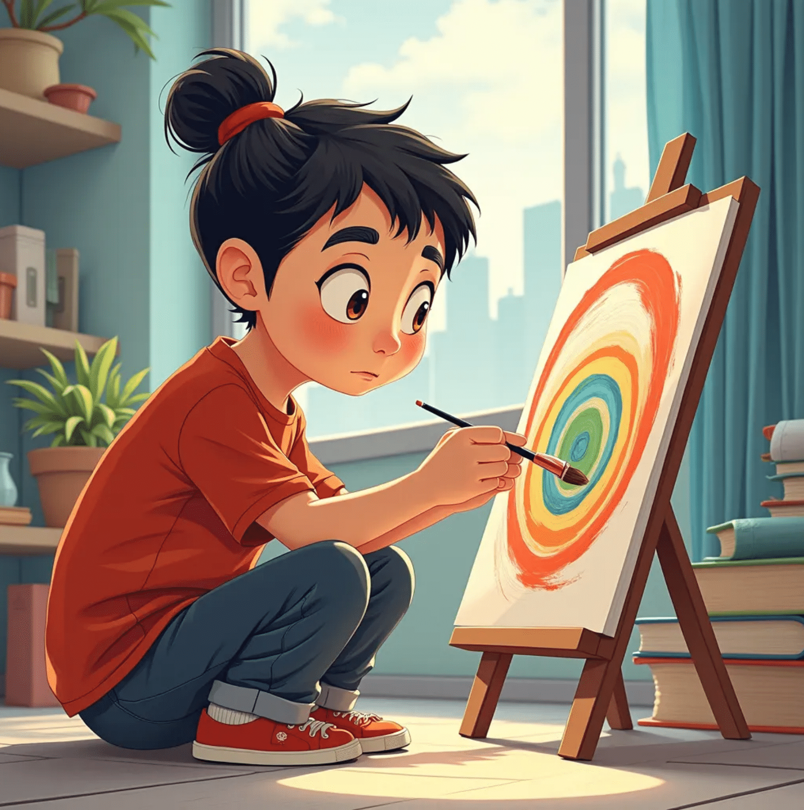
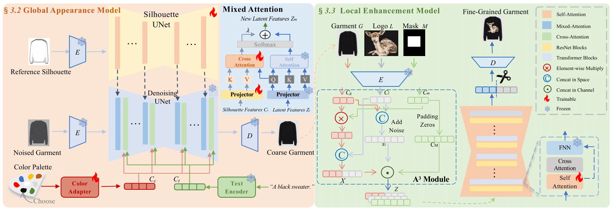
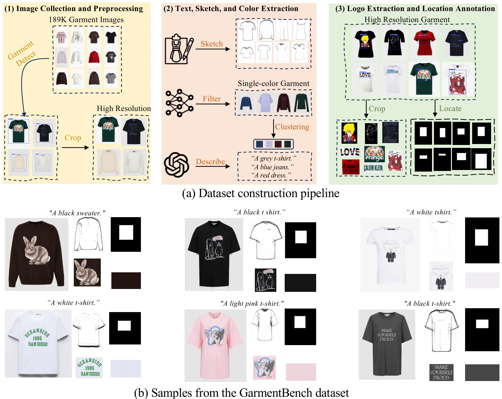
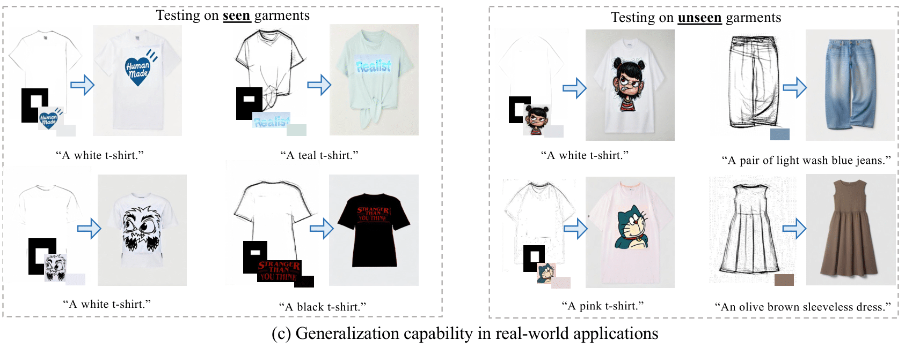
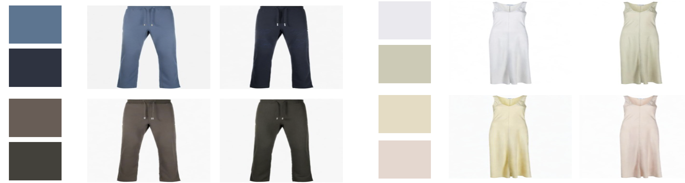
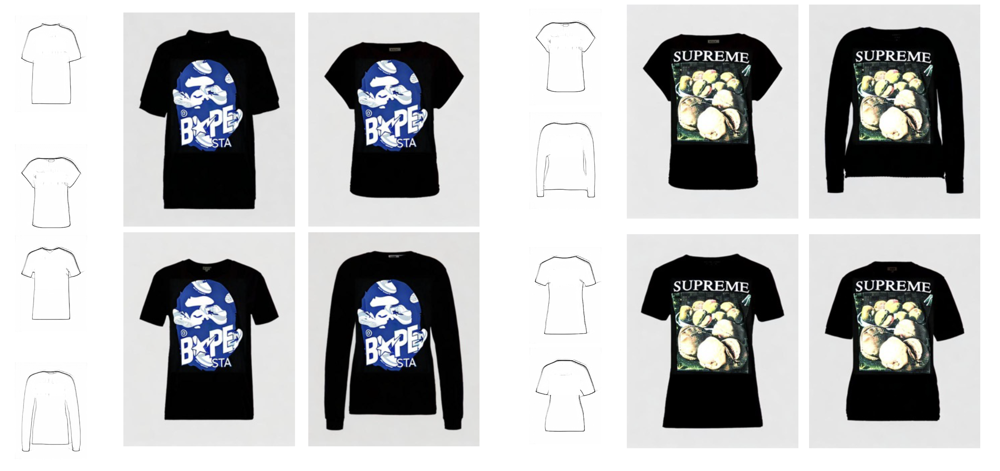
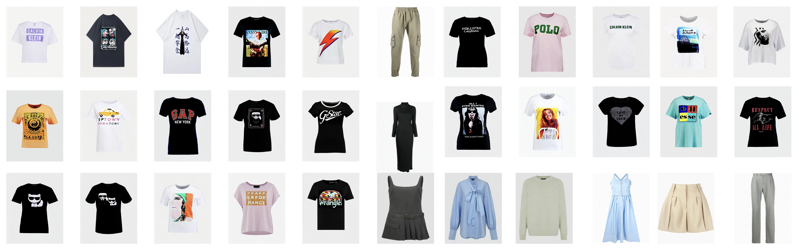
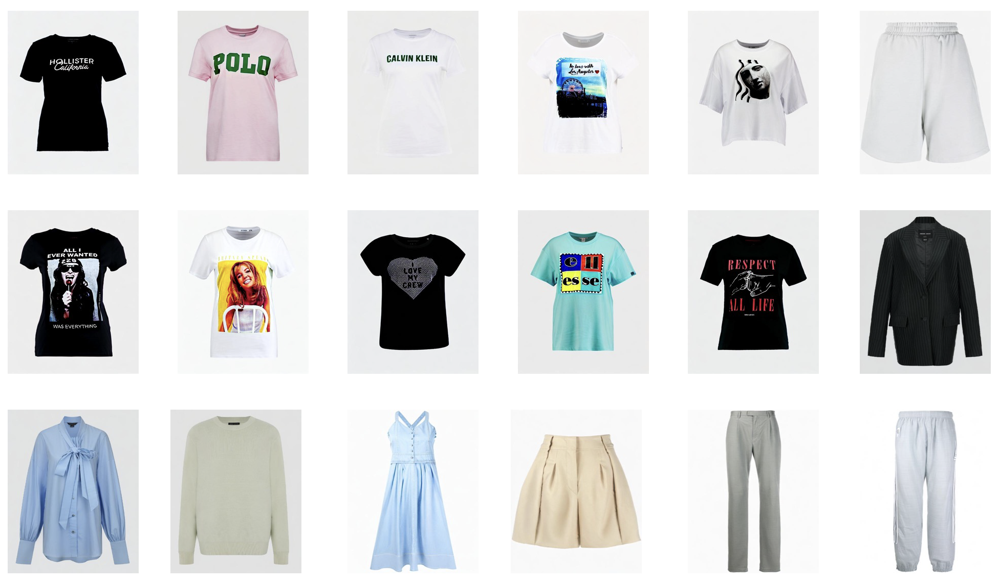

# IMAGGarment-1: Fine-Grained Garment Generation for Controllable Fashion Design


<a href='https://revive234.github.io/imaggarment.github.io/'></a>
<a href='https://arxiv.org/pdf/2504.13176'></a>
<a href='https://huggingface.co/keimen/IMAGGarment'></a>
<a href='https://huggingface.co/datasets/IMAGDressing/IGPair'></a>
[](https://github.com/muzishen/IMAGGarment-1)


## 🗓️ Release

- [2025/4/18] 🔥 We released the [technical report](https://arxiv.org/pdf/2504.13176) of IMAGGarment-1.
- [2025/4/18] 🔥 We release the train and inference code of IMAGGarment-1.
- [2025/4/17] 🎉 We launch the [project page](https://revive234.github.io/imaggarment.github.io/) of IMAGGarment-1.


## 💡 Introduction
IMAGGarment-1 addresses the challenges of multi-conditional controllability in personalized fashion design and digital apparel applications.
Specifically, IMAGGarment-1 employs a two-stage training strategy to separately model global appearance and local details, while enabling unified and controllable generation through end-to-end inference.
In the first stage, we propose a global appearance model that jointly encodes silhouette and color using a mixed attention module and a color adapter.
In the second stage, we present a local enhancement model with an adaptive appearance-aware module to inject user-defined logos and spatial constraints, enabling accurate placement and visual consistency.


## 🚀 Dataset Demo


## 🚀 Examples




### Different Colors and Silhouettes
<p align="center">
  
</p>

<p align="center">
  
</p>


### More Results
<p align="center">
  
</p>

<p align="center">
  
</p>


## 🔧 Requirements

- Python>=3.8
- [PyTorch>=2.0.0](https://pytorch.org/)
- cuda>=11.8
```
conda create --name IMAGGarment python=3.8.8
conda activate IMAGGarment
pip install -U pip

# Install requirements
pip install -r requirements.txt
```
## 🌐 Download Models

You can download our models from [百度云](https://pan.baidu.com/s/1_nlOTiLqeRYBNb0w0249vQ?pwd=ky3q#list/path=%2F). You can download the other component models from the original repository, as follows.
- stabilityai/sd-vae-ft-mse(https://huggingface.co/stabilityai/sd-vae-ft-mse)
- if train: [stable-diffusion-v1-5/stable-diffusion-v1-5](https://huggingface.co/stable-diffusion-v1-5/stable-diffusion-v1-5), if test: [SG161222/Realistic_Vision_V4.0_noVAE](https://huggingface.co/SG161222/Realistic_Vision_V4.0_noVAE)
- [h94/IP-Adapter](https://huggingface.co/h94/IP-Adapter)
- [stable-diffusion-v1-5/stable-diffusion-inpainting](https://huggingface.co/stable-diffusion-v1-5/stable-diffusion-inpainting)

## 🚀 How to train
```
# Please download the GarmentBench data first 
# and modify the path in train_color_adapter.sh, train_stage1.sh and train_stage2.sh

# train color adapter
sh train_color_adapter.sh
# Once training of color adapter is complete, you can convert the weights into the desired format.
python change.py

# train GAM model
sh train_GAM.sh
# train LEM model
sh train_LEM.sh
```

### 🧩 Spatial texture mode (recommended)

`IMAGGarment-1` spatial path now uses **decoupled texture-first multi-scale spatial injection**:
- `token`: texture-token conditioning only
- `spatial`: decoupled texture-first spatial injection only (**recommended**)
- `hybrid`: token + decoupled texture-first spatial injection

Joint training example:
```bash
accelerate launch train_GAM_texture_joint.py \
  --pretrained_model_name_or_path stable-diffusion-v1-5/stable-diffusion-v1-5 \
  --pretrained_vae_model_path stabilityai/sd-vae-ft-mse \
  --dataset_json_path /path/to/train_joint_texture.json \
  --data_root_path /path/to/GarmentBench \
  --texture_adapter_ckpt /path/to/texture_adapter_checkpoint.pt \
  --texture_condition_mode spatial \
  --texture_preprocess_mode crop_tile \
  --lambda_style 0.5 \
  --alpha1 1.0 --alpha2 1.0 --alpha3 0.7 --alpha4 0.5 \
  --output_dir /path/to/output
```

### 📊 Use Weights & Biases (wandb) for training monitoring
All three training scripts now support wandb directly:

```bash
--report_to wandb \
--wandb_project IMAGGarment-1 \
--wandb_run_name exp_name \
--wandb_mode online
```

The training loop logs dataset and step metrics such as `train/loss`, `train/lr`, `train/data_time`, and `train/step_time`.

### 🎛️ Texture control tuning knobs
- `train_texture_adapter.py` now supports condition drop rates:
  - `--i_drop_rate` (drop texture image condition)
  - `--t_drop_rate` (drop text condition)
  - `--ti_drop_rate` (drop both)
- training shape controls:
  - `--width`, `--height` (used by resize/crop pipeline)
- inference controls:
  - `--guidance_scale`, `--sketch_scale`, `--ipa_scale`, `--num_inference_steps`
- BF texture-only training module:
  - `--bf_num_tokens`
  - `--bf_base_channels`

## 🚀 How to test
```
python inference_IMAGGarment-1.py \
--GAM_model_ckpt [GAM checkpoint] \
--sketch_path [your sketch path] \
--texture_path [your texture path] \
--prompt [your prompt] \
--output_path [your save path] \
--texture_ckpt [texture adapter checkpoint] \
--texture_condition_mode spatial \
--texture_preprocess_mode crop_tile \
--alpha1 1.0 --alpha2 1.0 --alpha3 0.7 --alpha4 0.5 \
--ipa_scale 1.4 \
--guidance_scale 5.5 \
--device [your device]
```

### Migration note
- Old token path remains available with `--texture_condition_mode token`.
- New experiments should default to `--texture_condition_mode spatial`.
- Keep `--texture_preprocess_mode` consistent across texture training, joint training, and inference.

## 🧪 Round-2 / research mode

### New flags (joint training)
- `--joint_t_drop_rate`, `--joint_i_drop_rate`, `--joint_ti_drop_rate`
- `--style_loss_type {gram,gram+patch}`
- `--lambda_patch_style`
- `--val_vis_steps` (save token/spatial/hybrid validation grids to `val_outputs/step_xxxxxx/<mode>/`)

### Recommended first experiment
- `--texture_condition_mode spatial`
- `--lambda_style 0.5`
- `--joint_t_drop_rate 0.2 --joint_i_drop_rate 0.05 --joint_ti_drop_rate 0.05`
- `--texture_preprocess_mode crop_tile`

### Ablation commands (examples)
1. **baseline token**
```bash
accelerate launch train_GAM_texture_joint.py ... --texture_condition_mode token --lambda_style 0.0
```
2. **spatial decoupled**
```bash
accelerate launch train_GAM_texture_joint.py ... --texture_condition_mode spatial --lambda_style 0.5
```
3. **hybrid decoupled**
```bash
accelerate launch train_GAM_texture_joint.py ... --texture_condition_mode hybrid --lambda_style 0.5
```
4. **spatial + style loss**
```bash
accelerate launch train_GAM_texture_joint.py ... --texture_condition_mode spatial --lambda_style 0.5 --style_loss_type gram
```
5. **hybrid + style loss**
```bash
accelerate launch train_GAM_texture_joint.py ... --texture_condition_mode hybrid --lambda_style 0.5 --style_loss_type gram
```
6. **spatial + style loss + joint dropout**
```bash
accelerate launch train_GAM_texture_joint.py ... --texture_condition_mode spatial --lambda_style 0.5 --joint_t_drop_rate 0.2 --joint_i_drop_rate 0.05 --joint_ti_drop_rate 0.05
```

### Diagnostics tool
```bash
python tools/texture_diagnostics.py \
  --gam_ckpt /path/to/GAM.pt \
  --texture_ckpt /path/to/texture_adapter.bin \
  --sketch_path /path/to/sketch2.png \
  --prompt "a blue jacket" \
  --conflict_prompt "a bright red jacket" \
  --texture_condition_mode spatial \
  --texture_preprocess_mode crop_tile \
  --output_dir diagnostics_output
```

## 📊 Round-3 / Evaluation and Ablation

### 1) Fixed benchmark split
Create or reuse a reproducible fixed split:
```bash
python tools/run_fixed_benchmark.py \
  --dataset_json /path/to/train_joint_texture.json \
  --data_root /path/to/GarmentBench \
  --split_path eval/benchmarks/fixed_val_split.json \
  --num_samples 16 \
  --seed 42 \
  --gam_ckpt /path/to/GAM.pt \
  --texture_ckpt /path/to/texture_adapter.bin \
  --run_name step_000500
```

### 2) Texture reliance analysis
```bash
python tools/analyze_texture_reliance.py \
  --gam_ckpt /path/to/GAM.pt \
  --texture_ckpt /path/to/texture_adapter.bin \
  --sketch_path /path/to/sketch2.png \
  --real_texture_path /path/to/texture.png \
  --prompt "a blue jacket" \
  --output_dir eval_outputs/texture_reliance
```

### 3) Ablation suite
Prepare a json map from experiment name/mode to checkpoint path:
```json
{
  "token": "/path/to/token_gam.pt",
  "spatial": "/path/to/spatial_gam.pt",
  "hybrid": "/path/to/hybrid_gam.pt"
}
```

Run:
```bash
python tools/run_ablation_suite.py \
  --dataset_json /path/to/train_joint_texture.json \
  --data_root /path/to/GarmentBench \
  --split_path eval/benchmarks/fixed_val_split.json \
  --texture_ckpt /path/to/texture_adapter.bin \
  --mode_ckpt_map_json /path/to/mode_ckpt_map.json \
  --output_dir eval_outputs/ablation_suite
```

### Output structure
- `eval/benchmarks/fixed_val_split.json`
- `eval_outputs/<run_name>/per_image_metrics.csv|json`
- `eval_outputs/<run_name>/summary_metrics.csv|json|md`
- `eval_outputs/texture_reliance/texture_reliance.csv|json|md`
- `eval_outputs/ablation_suite/ablation_results.csv|json|md`
- `experiment_manifest.json` next to each run output

### Recommended workflow
1. Train checkpoint  
2. Run fixed benchmark  
3. Run texture reliance analysis  
4. Run ablation suite  
5. Compare token/spatial/hybrid in markdown/csv reports
原模型
python inference_IMAGGarment-1.py --GAM_model_ckpt ./weight/GAM.pt --sketch_path ./assets/sketch.png --texture_path ./assets/texture1.png --prompt "a blue long-sleeved shirt with a collar, chest pocket, and snap buttons, featuring an adidas spezial patch and a mountain logo on the left chest." --output_path ./outputs/test_tshirt_shirtmask.png --texture_ckpt ./output/texture_adapter_MMG/checkpoint-21900/texture_adapter.bin --device cuda
python inference_IMAGGarment-1.py --GAM_model_ckpt ./weight/GAM.pt --LEM_model_ckpt ./weight/LEM.bin --sketch_path ./assets/sketch.png --logo_path ./assets/logo.png --mask_path ./assets/shirt_mask.png --texture_path ./assets/texture1.png --prompt "a blue long-sleeved shirt with a collar, chest pocket, and snap buttons, featuring an adidas spezial patch and a mountain logo on the left chest." --output_path ./outputs/test_tshirt_shirtmask.png --texture_ckpt ./output/texture_adapter_MMG/checkpoint-21900/texture_adapter.bin --device cuda

现模型
python inference_IMAGGarment-1.py --GAM_model_ckpt ./weight/GAM.pt --sketch_path ./assets/sketch.png --texture_path ./assets/texture1.png --prompt "a blue long-sleeved shirt with a collar, chest pocket, and snap buttons, featuring an adidas spezial patch and a mountain logo on the left chest." --output_path ./outputs/test_tshirt_shirtmask_MMG_Bf_TexTure_final.png --texture_ckpt ./output/texture_adapter_MMG_Bf_Texture/final_checkpoint/texture_adapter.bin --ipa_scale 1.4 --guidance_scale 5.5 --device cuda

--adam_beta1 0.9
  --adam_beta2 0.999
  --adam_epsilon 1e-8
  --max_grad_norm 1.0
  --lr_scheduler cosine
  --lr_warmup_steps 300
  --loss_type huber
  --huber_c 0.1
  --gradient_accumulation_steps 1

## Acknowledgement
We would like to thank the contributors to the [IMAGDressing](https://github.com/muzishen/IMAGDressing) and [IP-Adapter](https://github.com/tencent-ailab/IP-Adapter) repositories, for their open research and exploration.

The IMAGGarment code is available for both academic and commercial use. Users are permitted to generate images using this tool, provided they comply with local laws and exercise responsible use. The developers disclaim all liability for any misuse or unlawful activity by users.
## Citation
If you find IMAGDressing-v1 useful for your research and applications, please cite using this BibTeX:

```bibtex
@article{shen2025IMAGGarment-1,
  title={IMAGGarment-1: Fine-Grained Garment Generation for Controllable Fashion Design},
  author={Shen, Fei and Yu, Jian and Wang, Cong and Jiang, Xin and Du, Xiaoyu and Tang, Jinhui},
  booktitle={arXiv preprint arXiv:2504.13176},
  year={2025}
}
```
## 🕒 TODO List
- [x] Paper
- [x] Train Code
- [x] Inference Code
- [ ] GarmentBench Dataset
- [x] Model Weights
- [ ] Upgraded Version for High-resolution Images
## 📨 Contact
If you have any questions, please feel free to contact with us at shenfei140721@126.com and jianyu@njust.edu.cn.
